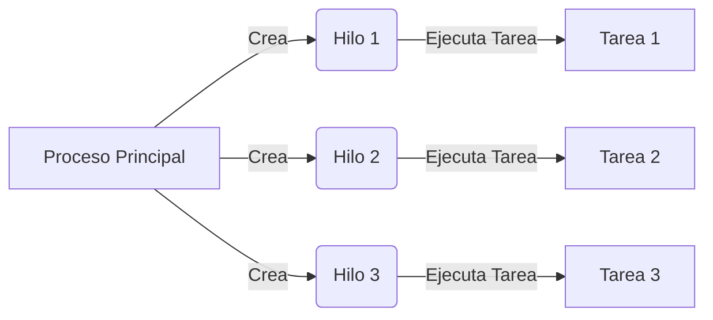
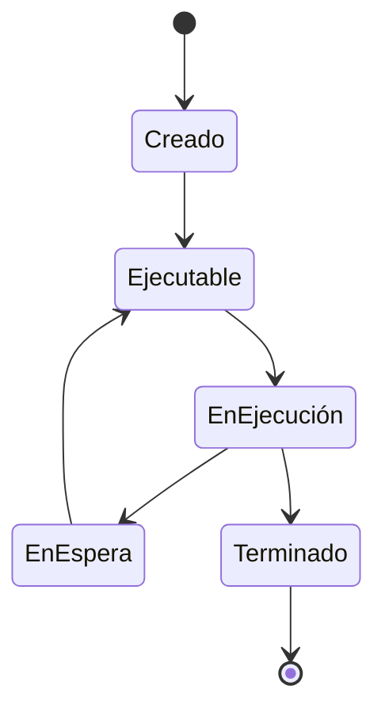
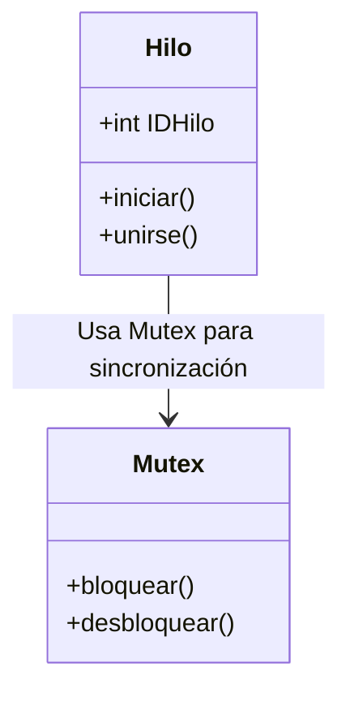
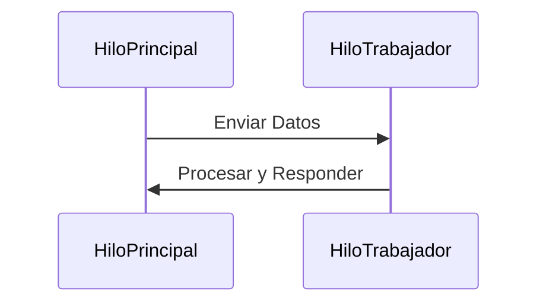
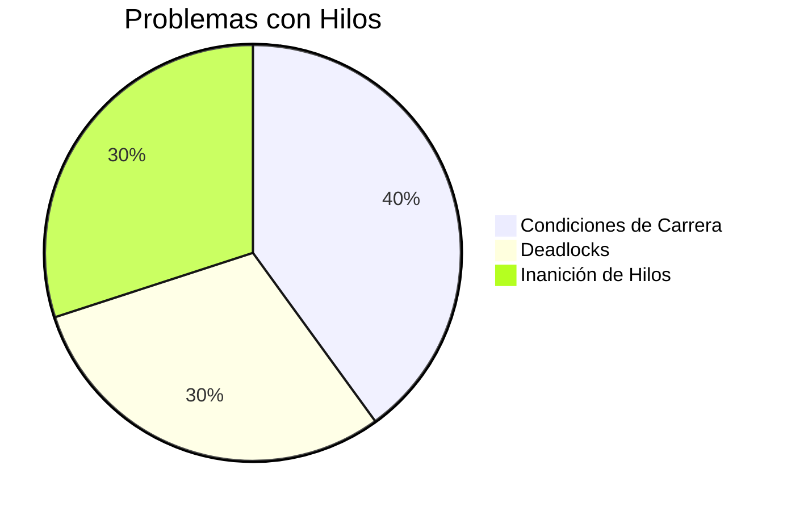

# Sobre los Hilos (Threads)

## **¿Qué son los Hilos?**

Un **hilo** es la unidad más pequeña de ejecución dentro de un proceso. Permite la ejecución concurrente de tareas, mejorando la eficiencia y capacidad de respuesta en aplicaciones. Múltiples hilos dentro de un proceso comparten el mismo espacio de memoria pero se ejecutan de manera independiente, lo que los hace ideales para tareas que requieren paralelismo.

Los hilos se manejan comúnmente usando **POSIX Threads (pthreads)** en C, donde los desarrolladores pueden crear y sincronizar hilos para diversas aplicaciones como procesamiento en tiempo real, computación paralela y sistemas multi-usuario.

---

## **Cómo Funcionan los Hilos**

Los hilos operan dentro de procesos, utilizando recursos compartidos mientras mantienen contextos de ejecución separados.



## Ciclo de Vida de un Hilo

Los hilos siguen un ciclo de vida con diferentes estados: creación, ejecución, espera y terminación.



## Sincronización de Hilos

Dado que los hilos comparten memoria, se usan mecanismos de sincronización como mutexes para evitar interferencias con recursos compartidos.



## Comunicación entre Hilos

Los hilos intercambian datos usando memoria compartida u otros métodos de comunicación.



## Rendimiento y Ejecución Paralela

La ejecución en paralelo mejora la velocidad y eficiencia del procesamiento.

```mermaid
gantt
    title Línea de Tiempo de Ejecución de Hilos
    dateFormat  HH:MM
    section Hilo 1
    Tarea A :done, start, 12:00, 12:10
    Tarea B :active, 12:10, 12:20
    section Hilo 2
    Tarea C :done, start, 12:00, 12:15
    Tarea D :active, 12:15, 12:25
```

## Desafíos del Multihilo
Aunque los hilos mejoran el rendimiento, también presentan desafíos:

- **Condiciones de Carrera:** Múltiples hilos accediendo al mismo recurso simultáneamente.
- **Deadlocks:** Dos o más hilos esperando indefinidamente recursos de los otros.
- **Inanición de Hilos:** Hilos de baja prioridad que nunca obtienen tiempo de CPU.



