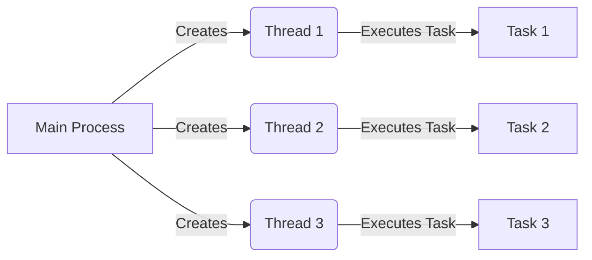
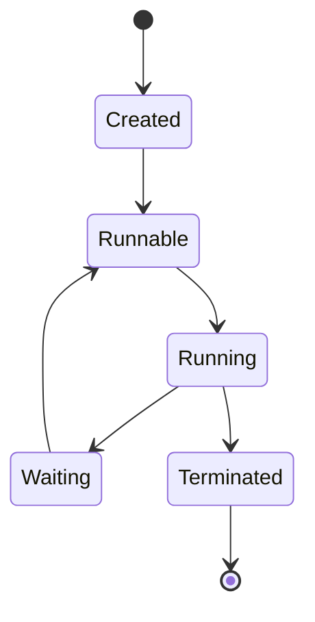
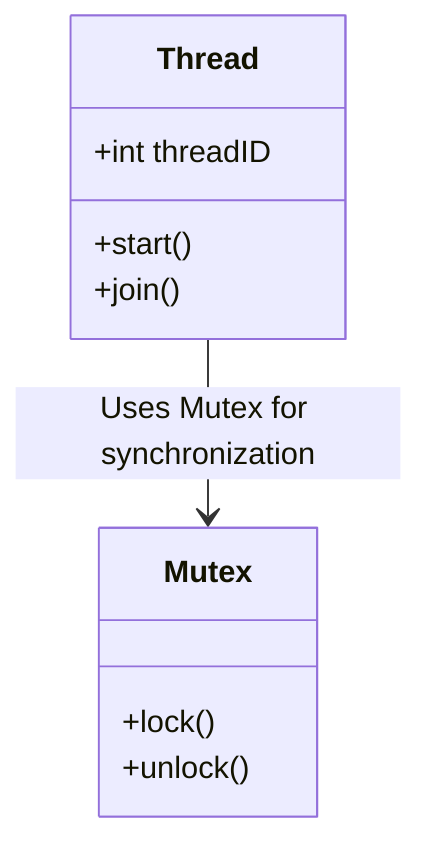
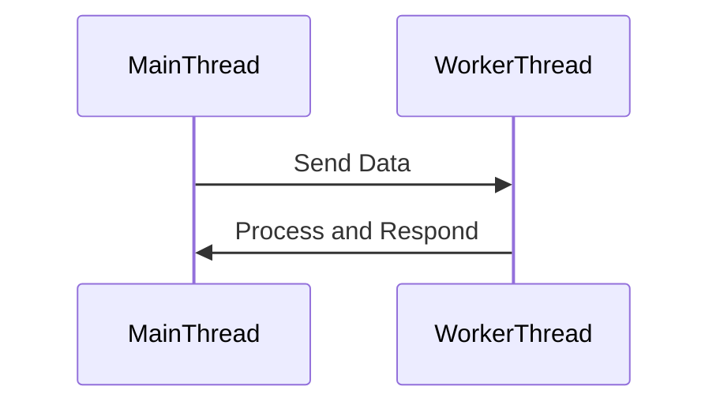
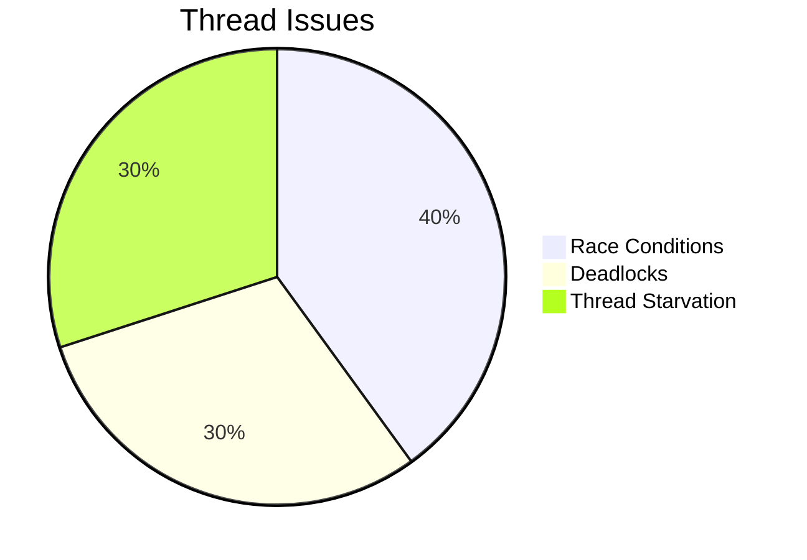

# About Threads

## **What Are Threads?**

A **thread** is the smallest unit of execution within a process. It allows concurrent execution of tasks, improving efficiency and responsiveness in applications. Multiple threads within a process share the same memory space but execute independently, making them suitable for tasks that require parallelism.

Threads are commonly managed using **POSIX Threads (pthreads)** in C, where developers can create and synchronize threads for various applications like real-time processing, parallel computing, and multi-user systems.

---

## **How Threads Work**

Threads operate within processes, using shared resources while maintaining separate execution contexts.



## Thread Lifecycle

Threads follow a lifecycle consisting of different states: creation, execution, waiting, and termination.



## Thread Synchronization

Since threads share memory, synchronization mechanisms like mutexes ensure that multiple threads do not interfere with shared resources.



## Thread Communication

Threads often exchange data using shared memory or inter-thread communication methods.



## Thread Performance & Parallel Execution

Parallel execution improves processing speed and efficiency.

```mermaid
gantt
    title Thread Execution Timeline
    dateFormat  HH:MM
    section Thread 1
    Task A :done, start, 12:00, 12:10
    Task B :active, 12:10, 12:20
    section Thread 2
    Task C :done, start, 12:00, 12:15
    Task D :active, 12:15, 12:25
```

## Multithreading Challenges

While threads improve performance, they also introduce challenges:

- **Race Conditions:** Multiple threads accessing the same resource simultaneously.
- **Deadlocks:** Two or more threads waiting for each other's resource indefinitely.
- **Thread Starvation:** Low-priority threads never getting CPU time.

